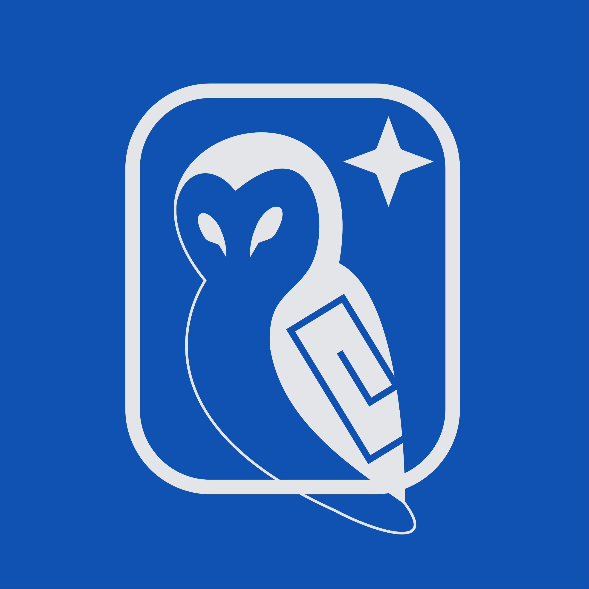
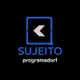

<h1 align="center">Tiago Gomides — Front-End com Propósito</h1>

<p align="center">
  
</p>

---

### 🚀 Sobre mim

Desenvolvedor Front-End desde 2021, apaixonado por inovação, usabilidade e soluções que geram impacto real.  

🎓 Estudante de SI na XP Educação, entre os 1% de destaque entre 127 mil candidatos.  

💻 Especializado em interfaces responsivas, acessíveis e performáticas, com domínio em React.js, React Native, Node.js e TypeScript.  

🔍 Destaque em pesquisa científica com foco em UX e avaliação pós-ocupação.  

🌐 Forte em integração com APIs, design systems e versionamento.

🚀 Proativo, colaborativo e com visão de produto.  

✨ Busco conexões, parcerias e projetos que unam tecnologia e propósito.  

🔎 Aberto a oportunidades que acelerem meu crescimento e ampliem minha rede.

## 👨‍🚀 Modo Desenvolvedor: ATIVADO

```ts
> npx tiagogomides
> dev gomides --focus "React | Next | UX"
> status --online
> coffee --strong
> motto "Desenvolva com propósito ☕"
```
```ts
const tiago = {
  viciadoEm: ["café", "usabilidade", "componentes reutilizáveis"],
  poderesEspeciais: ["Storybook Ninja", "Dark Mode Evangelist"],
  debug: true,
  status: "Buscando projetos com propósito 🚀"
};
```

### 🧰 Meu arsenal de tecnologias
<p align="center">
  
</p>

## Experiência de trabalho

Na visão geral abaixo você encontrará minha experiência de trabalho mais recente:

[](https://www.linkedin.com/company/equipemetis/posts/?feedView=all)

**Desenvolvedor Front end** \
[**Metis**](https://www.linkedin.com/company/equipemetis/posts/?feedView=all) • Voluntario \
Linguagens & Tecnologias: *`Next.js`*, *`Tailwind`*, *`Jest`*, *`Cypress`*,*`Git`*,*`GitHub`*,*`ClikUp`*.\
Projetos em destaque: [`Educagil`]()
<br/>


[](https://pipocaagil.com.br/)

**Desenvolvedor Front end** \
[**Pipoca Agil**](https://pipocaagil.com.br/) • Freelance \
Linguagens & Tecnologias: *`Next.js`*, *`Tailwind`*, *`Jest`*, *`Cypress`*`Git`*,*`GitHub`, `ClikUp` .\
Projetos em destaque: [`Educagil`]()
<br/>

[](hhttps://www.linkedin.com/company/tt-t-solu%C3%A7%C3%B5es-em-inform%C3%A1tica-ltda/)

**Frot-end Developer (Estagio)** \
[**TT&T Soluções em Informática Ltda**](https://www.linkedin.com/company/tt-t-solu%C3%A7%C3%B5es-em-inform%C3%A1tica-ltda/) • Estagio \
Linguagens & Tecnologias: *`JavaScript`*, *`Node`*, *`React`*, *`React Native`*, *`Html`*, *`Css`*, *`Git`*,*`GitHub`*,*`Trelo`*,*`Jira`*.\
Projetos em destaque: [`HI100`](), [`Testes de Estagiarios`](https://github.com/TiagoGomides/Desafio-de-Nivelamento-TT-T-Acelere-sua-evolucao-como-desenvolvedor)
<br/>

### Formação Acadêmica

Na visão geral abaixo você encontrará meus cursos e especializaçoes mais recente:

[](https://www.xpeducacao.com.br/)

**Sistemas de Informaçao** \
[**XPE**](https://www.xpeducacao.com.br/) • Bacharel \
Linguagens & Tecnologias: *`Java`*,*`Html`*,*`Css`*,*`React`*,*`Sql`*,*`NoSql`*,*`Figma`*,*`MongoDB`*,*`Docker`* .\
Projetos em destaque: [`A tecnologia da informação como ferramenta de desenvolvimento`](), [`Dashboard de Controle Empresarial`](https://drive.google.com/file/d/1HbLPBdCTzpWWyQqad6JJmOMkiNefEA5R/view?usp=sharing)
<br/>

[](https://frontpush.com.br/)

**Frontpush** \
[**Frontpush**](https://frontpush.com.br/) • Curso Livre \
Linguagens & Tecnologias: *`Html`*,*`Css`*,*`React`*,,*`Figma`*,*`GSAP`*, *`Barba.js`*.\
Projetos em destaque: [`Portifolio`](https://tiagogomides.com.br/), [`Spider-man`]()
<br/>

[](https://sujeitoprogramador.com/fabricadeaplicativos/)

**Fabrica de Aplicativos** \
[**Sujeito Programador**](https://sujeitoprogramador.com/fabricadeaplicativos/) • Curso Livre \
Linguagens & Tecnologias: *`Html`*,*`Css`*,*`JavaScript`*,*`React`*,*`React Native`*,*`Next.js`*,*`Figma`*,*`Expo`*\
Projetos em destaque: [`App Finanças`](), [`HeyGrupos - App Chat`](),[`Sistema pizzaria`]()
<br/>


Por favor, encontre-me no [LinkedIn](https://www.linkedin.com/in/gomides-tiago/) para uma descrição mais detalhada da minha experiência de trabalho, educação e certificação.


### <p align="center">🤝 Bora se conectar?</p>


[](https://www.linkedin.com/in/gomides-tiago/)
[](https://tiagogomides.com.br/)
[](mailto:gomidestiago@outlook.com)
[](https://wa.me/5532998145630)
[](https://www.behance.net/tiagogomides1)
[](https://github.com/tiagogomides)

<p align="center">
  
</p>
